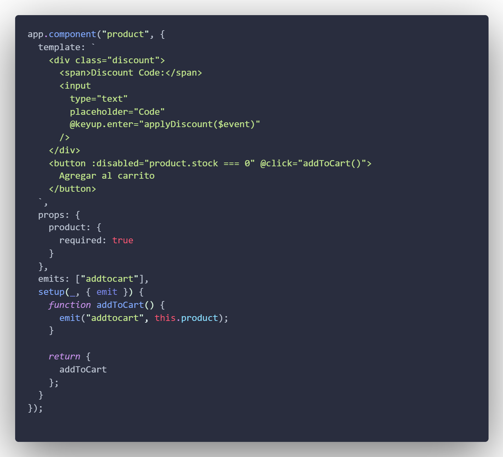
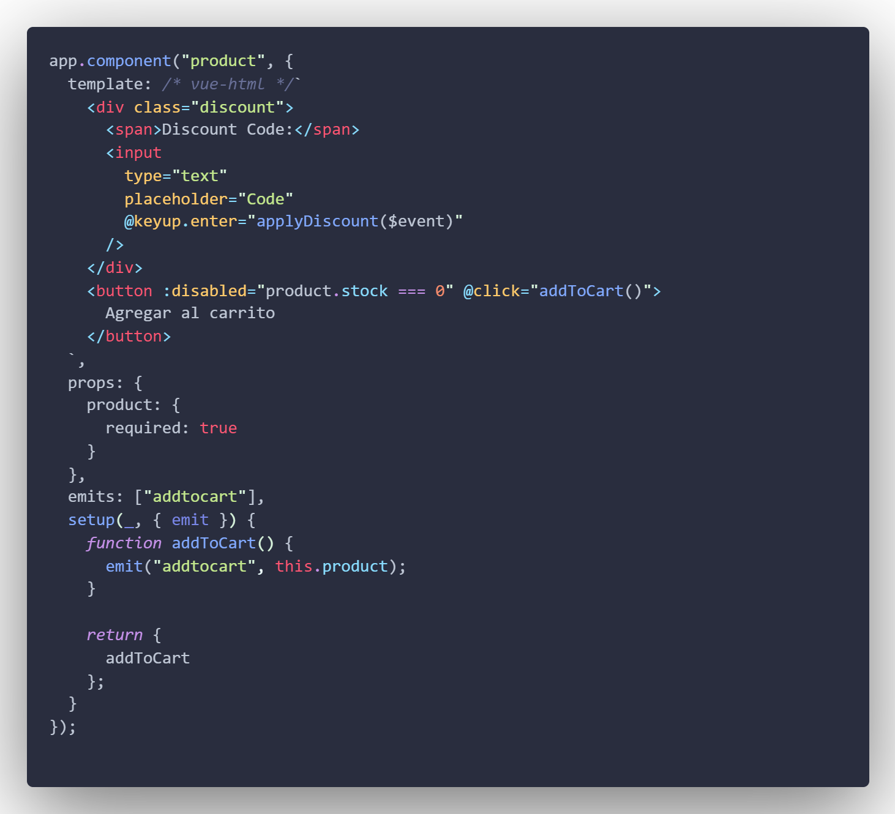

# vuehtml

Syntax Highlight for Vue HTML inside `template strings` and `.html files`.

## Features

Use it in `template string` as:

#### Before

---

#### After

> Note: This extension will automatically add syntax highlight inside .html

---

## Author - Samuel Burbano [IOSamuel]

    
    
    
    
    

